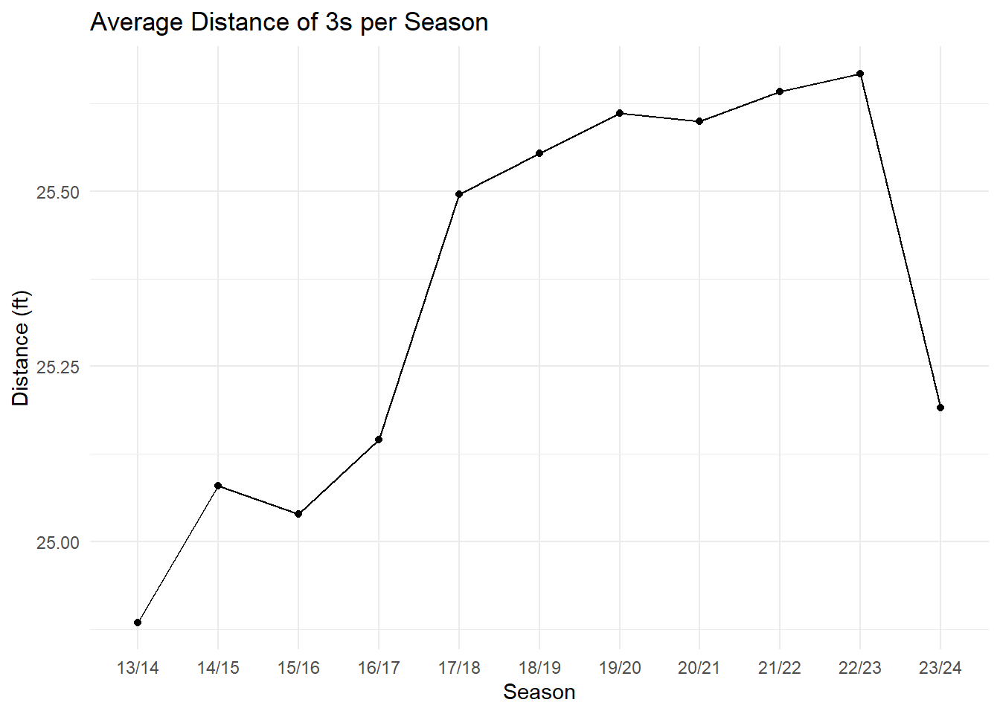
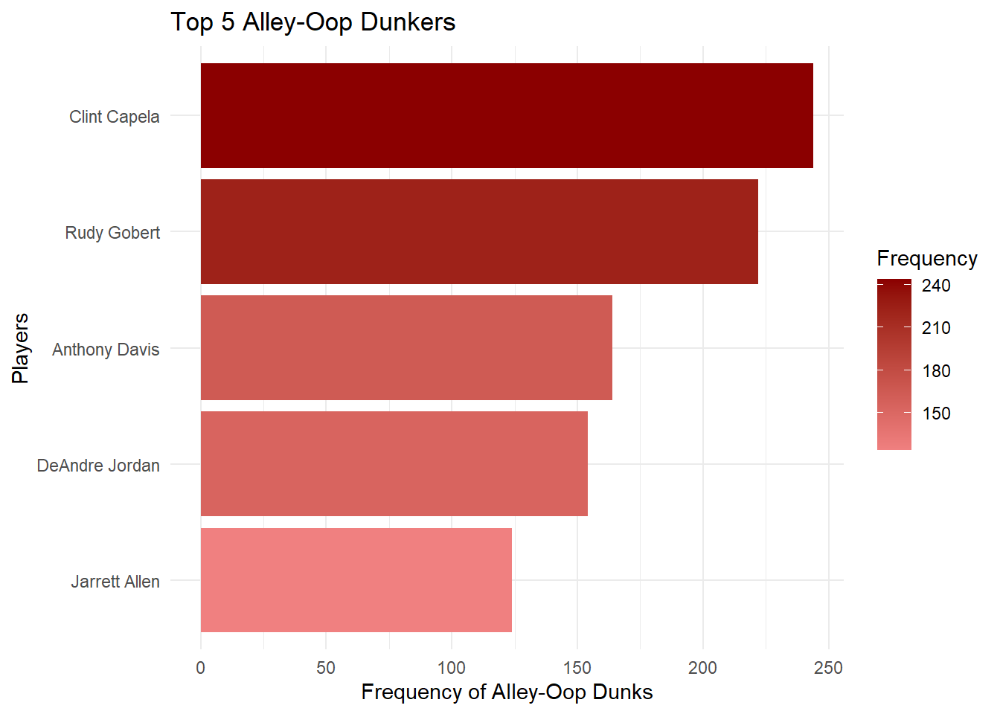
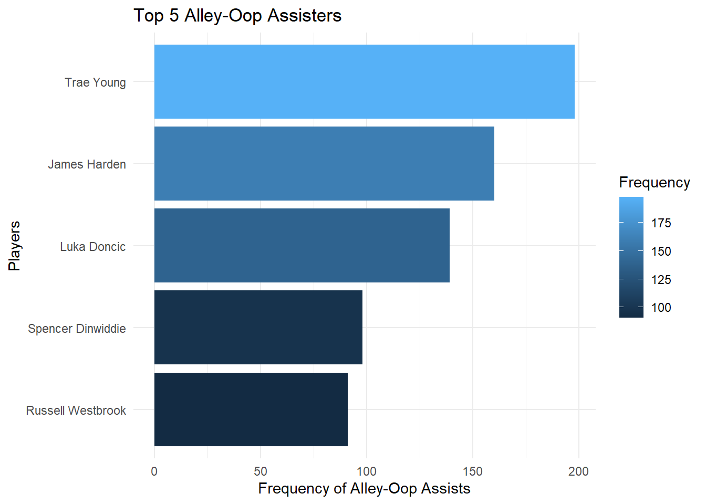
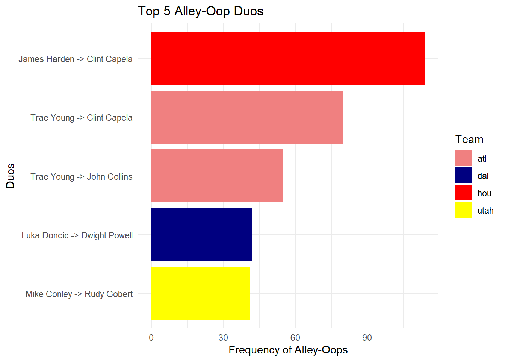
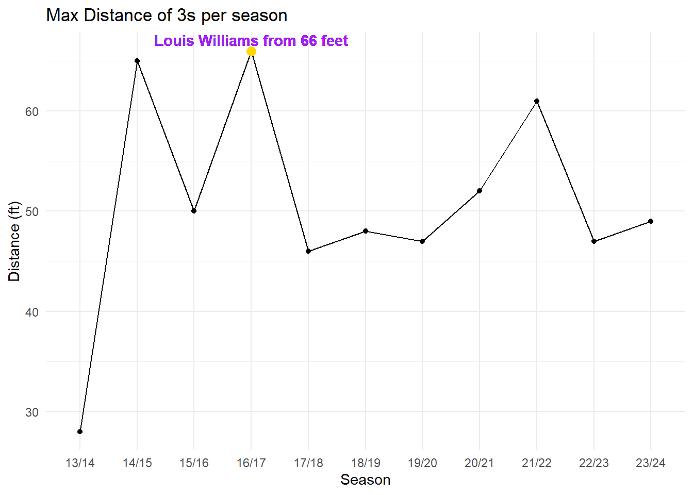
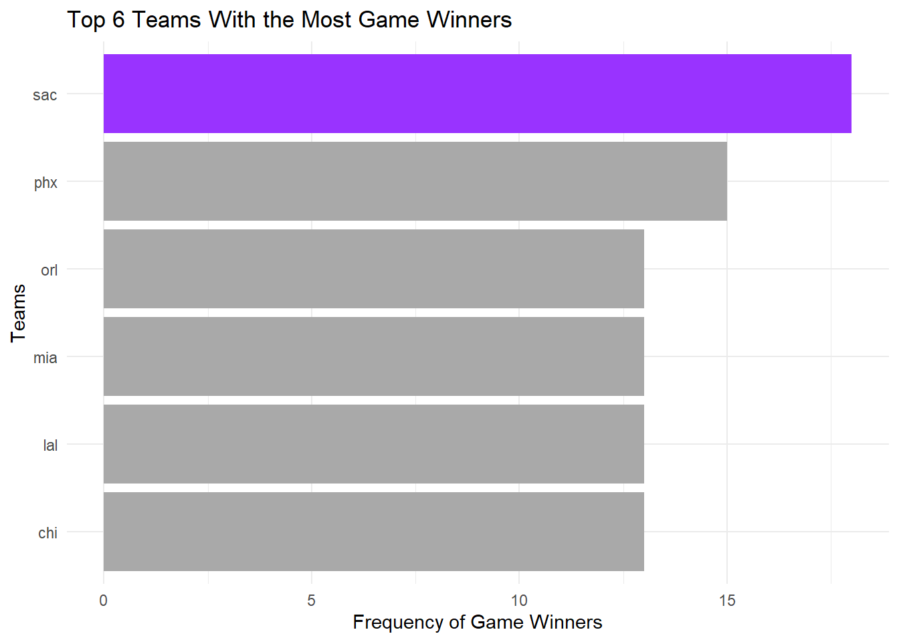

# Highlight Play Creators in the NBA

**Author**  
Aziz Al Mezraani

### Quick Overview of Repository
This repo contains two homeworks and a final project for the Data Wrangling course using R. The focus was on cleaning, reshaping, and preparing messy datasets for analysis.

The final report explores NBA play-by-play data to identify top alley-oop duos, long-distance shooters, and clutch performers. All tasks demonstrate practical data wrangling techniques for real-world data.

## Introduction

Personally, I love sports and one of my favorite sports is basketball. When watching, playing, or even gaming basketball there are 5 main plays that get me excited. Poster dunks, chase down blocks, alley-oop dunks, ankle breakers, long distance three pointers, and game winners. Unfortunately with the data set I have I can only analyze 3 of these 6 highlight plays: alley-oop dunks, long distance threes, and game winners.

## Primary Questions

1. Between 2014 and 2024, who contributed to the most alley-oop dunks?  
Specifically, I expect to see LeBron in the Top 5 with all the highlight plays I have seen, however I have not watched consistently during that time frame. Or a center potentially.

2. What season contributed the most to long distance threes?  
I am planning to also look at the deepest 3 where I expect to see either Stephen Curry or Damian Lillard. As for which Season I remember 2015/2016 being a crazy year for deep 3s.

3. Which team has the clutchest players?  
Usually the best players get the chance to score game winners that is why I would expect a team with LeBron James, Stephen Curry, or Kevin Durant.

## Data

The data that I am using for this project can be accessed from ESPN (this is for one game)

```r
load('C:/Users/azizm/Documents/Uni/Data_Wrangling/nba_pbp_14_24.RData')

rmarkdown::paged_table(all_pbp_data)
```
|   |gameID    |play                                                         |link                                                   |time  |logo                                                                         | away_score| home_score| period|date     |shooter      |three | distance|result |assist |     x|  y|team |
|:--|:---------|:------------------------------------------------------------|:------------------------------------------------------|:-----|:----------------------------------------------------------------------------|----------:|----------:|------:|:--------|:------------|:-----|--------:|:------|:------|-----:|--:|:----|
|1  |400559374 |Chris Bosh vs. Tim Duncan (Mario Chalmers gains possession)  |https://www.espn.com/nba/playbyplay/_/gameId/400559374 |12:00 |https://a.espncdn.com/combiner/i?img=/i/teamlogos/nba/500/scoreboard/sa.png  |          0|          0|      1|20140605 |NA           |NA    |       NA|NA     |NA     |    NA| NA|sa   |
|2  |400559374 |Chris Bosh makes 15-foot two point shot                      |https://www.espn.com/nba/playbyplay/_/gameId/400559374 |11:40 |https://a.espncdn.com/combiner/i?img=/i/teamlogos/nba/500/scoreboard/mia.png |          2|          0|      1|20140605 |Chris Bosh   |FALSE |       15|made   |FALSE  | 14.89| 26|mia  |
|3  |400559374 |Chris Bosh shooting foul (Tiago Splitter draws the foul)     |https://www.espn.com/nba/playbyplay/_/gameId/400559374 |11:18 |https://a.espncdn.com/combiner/i?img=/i/teamlogos/nba/500/scoreboard/mia.png |          2|          2|      1|20140605 |NA           |NA    |       NA|NA     |NA     |    NA| NA|mia  |
|4  |400559374 |Tiago Splitter makes free throw 1 of 2                       |https://www.espn.com/nba/playbyplay/_/gameId/400559374 |11:18 |https://a.espncdn.com/combiner/i?img=/i/teamlogos/nba/500/scoreboard/sa.png  |          2|          1|      1|20140605 |NA           |NA    |       NA|NA     |NA     |    NA| NA|sa   |
|5  |400559374 |Tiago Splitter makes free throw 2 of 2                       |https://www.espn.com/nba/playbyplay/_/gameId/400559374 |11:18 |https://a.espncdn.com/combiner/i?img=/i/teamlogos/nba/500/scoreboard/sa.png  |          2|          2|      1|20140605 |NA           |NA    |       NA|NA     |NA     |    NA| NA|sa   |
|6  |400559374 |Chris Bosh makes three point jumper (Mario Chalmers assists) |https://www.espn.com/nba/playbyplay/_/gameId/400559374 |11:02 |https://a.espncdn.com/combiner/i?img=/i/teamlogos/nba/500/scoreboard/mia.png |          5|          2|      1|20140605 |Chris Bosh   |TRUE  |        0|made   |TRUE   |  4.26|  4|mia  |
|7  |400559374 |Kawhi Leonard lost ball turnover (Dwyane Wade steals)        |https://www.espn.com/nba/playbyplay/_/gameId/400559374 |10:51 |https://a.espncdn.com/combiner/i?img=/i/teamlogos/nba/500/scoreboard/sa.png  |          5|          2|      1|20140605 |NA           |NA    |       NA|NA     |NA     |    NA| NA|sa   |
|8  |400559374 |LeBron James makes two point shot                            |https://www.espn.com/nba/playbyplay/_/gameId/400559374 |10:45 |https://a.espncdn.com/combiner/i?img=/i/teamlogos/nba/500/scoreboard/mia.png |          7|          2|      1|20140605 |LeBron James |FALSE |        0|made   |FALSE  |  6.38| 50|mia  |
|10 |400559374 |Tim Duncan bad pass (Mario Chalmers steals)                  |https://www.espn.com/nba/playbyplay/_/gameId/400559374 |10:33 |https://a.espncdn.com/combiner/i?img=/i/teamlogos/nba/500/scoreboard/sa.png  |          7|          2|      1|20140605 |NA           |NA    |       NA|NA     |NA     |    NA| NA|sa   |
|11 |400559374 |Dwyane Wade bad pass (Danny Green steals)                    |https://www.espn.com/nba/playbyplay/_/gameId/400559374 |10:27 |https://a.espncdn.com/combiner/i?img=/i/teamlogos/nba/500/scoreboard/mia.png |          7|          2|      1|20140605 |NA           |NA    |       NA|NA     |NA     |    NA| NA|mia  |

To see the full first 500 rows click here: - [First 500 Rows](./paged_table.html)

While this data comes in relatively clean, there are a few important variables that I need to create to answer my questions. I’ll start with the most important steps so that I can look into alley-oop dunkers and assisters. To be able to completely capture my idea in Question 1, I need to extract the successful alley-oop dunks that were made from the play description. Then extract the dunker from the shooter column and the assister from the play description.

Moreover, I will be using functions from the following libraries throughout the report:

```r
library(ggplot2)
library(dplyr)
```

## Data Prep for Question 1

1. Finding made alley-oop dunks
```r
all_pbp_data$dunk_desc <- ifelse(
  stringr::str_detect(all_pbp_data$play, 'dunk'), 
  all_pbp_data$play, 
  NA
)

all_pbp_data$alley_oop_desc <- ifelse(
  stringr::str_detect(all_pbp_data$play, 'alley oop dunk'), 
  all_pbp_data$play, 
  NA
)
```

2. Extracting the dunkers
```r
all_pbp_data$alley_oop_dunker <- ifelse(stringr::str_detect(all_pbp_data$play, 'alley oop dunk') & stringr::str_detect(all_pbp_data$result, 'made'),
                                        all_pbp_data$shooter, NA)
```

3. Extracting the assisters
```r
all_pbp_data$alley_oop_assister <- stringr::str_extract(
  all_pbp_data$alley_oop_desc, 
  "(?<=\\().*(?= assists\\))"
)
```

## Data Prep for Question 2

For question 2 I will need to create a column that identifies the season the play occurred.  
To do that I will have to transform the date, extract the year and month,  
then assign a season based on the combination of year and month.

### 1. Changing date column format

```r
all_pbp_data$date <- lubridate::ymd(all_pbp_data$date)
```

> Warning: 25641 failed to parse.

### 2. Extracting year and month

```r
all_pbp_data$month <-  lubridate::month(all_pbp_data$date)
all_pbp_data$year <-  lubridate::year(all_pbp_data$date)
```

### 3. Assigning seasons depending on month and year (playoffs usually end in June)

```r
all_pbp_data$season <- ifelse(
  all_pbp_data$month >= 7,
  paste(substr(all_pbp_data$year,3,4), substr(all_pbp_data$year + 1,3,4), sep = '/'),
  paste(substr(all_pbp_data$year - 1,3,4), substr(all_pbp_data$year,3,4), sep = '/')
)
```
## Data Prep for Question 3

Making time a duration to be able to extract last 2 (dealing with every digit to fix the format for final conversion)

```r
all_pbp_data$time[grepl("^[0-9]{1}:[0-9]{2}$", all_pbp_data$time)] <- 
  paste0("00:0", all_pbp_data$time[grepl("^[0-9]{1}:[0-9]{2}$", all_pbp_data$time)])

all_pbp_data$time[grepl("^[0-9]{1,2}\\.[0-9]{1,2}$", all_pbp_data$time)] <- 
  paste0("00:00:", all_pbp_data$time[grepl("^[0-9]{1,2}\\.[0-9]{1,2}$", all_pbp_data$time)])

all_pbp_data$time[grepl("^[0-9]{2}:[0-9]{2}$", all_pbp_data$time)] <- 
  paste0("00:", all_pbp_data$time[grepl("^[0-9]{2}:[0-9]{2}$", all_pbp_data$time)])

all_pbp_data$time <- hms::as_hms(all_pbp_data$time)
```

---

Making free throws count as Made Shots

```r
all_pbp_data$result <- ifelse(grepl("makes", all_pbp_data$play), "made", all_pbp_data$result)
```

---

Getting all the made shots

```r
SortedMadeShots <- all_pbp_data %>% 
  filter(result == "made") %>%
  group_by(gameID) %>% 
  arrange(gameID, period, desc(time))
```

---

Creating a dataframe with the last 2 made shots of each game and labeling the last shot as a game winner or not

```r
Last2MadeShots <- SortedMadeShots %>% 
  group_by(gameID) %>% 
  slice_tail (n=2) %>%
  mutate(away_home_diff = away_score - home_score, 
         score_lag = lag(away_home_diff), 
         game_winner = ifelse(sign(away_home_diff) == sign(score_lag), "No", "Yes"))
```

---

Making time numeric to limit time to less than 30 seconds, and including only interesting rows and columns in dataframe

```r
Last2MadeShots$time_val <- as.numeric(Last2MadeShots$time)
GameWinners_df <- Last2MadeShots[Last2MadeShots$game_winner == 'Yes' & Last2MadeShots$time_val <= 30, ]
GameWinersSmall_df <-  GameWinners_df [,c("gameID","team","shooter","play")]
```

---

Fixing the issue for free throws where the shooter is listed as NA, and omitting all empty rows

```r
GameWinersSmall_df$shooter <-  ifelse(is.na(GameWinersSmall_df$shooter), 
                              stringr::str_extract(GameWinersSmall_df$play, "^\\w+ \\w+"), 
                              GameWinersSmall_df$shooter)
GameWinersSmall_df <- na.omit(GameWinersSmall_df)
```



## Methods

### Question 1

To be able to find out the answer to question 1 I have to nominally compare the number of alley-oop dunks, alley-oop dunk assisters and alley-oop duos to see who were the most prominent.\
This will include creating a new df or table that includes freq and dunker, or assister or both. Then I will have to sort the table to see the best on top.

---

**1. For alley-oop dunkers (top 5)**

```r
sorted_alley_oop_dunkers <- sort(table(all_pbp_data$alley_oop_dunker), decreasing=TRUE, na.rm = TRUE)
top_5_alley_oop_dunkers <- as.data.frame(sorted_alley_oop_dunkers[1:5])
```

---

**2. For alley-oop assisters (top 5)**

```r
sorted_alley_oop_assisters <- sort(table(all_pbp_data$alley_oop_assister), decreasing=TRUE, na.rm = TRUE)
top_5_alley_oop_assisters <- as.data.frame(sorted_alley_oop_assisters[1:5])
```

---

**3. For alley-oop duos (top 5)**\
*(also had to make new column with both dunker and assister name)*

```r
agg_alley_oop <- aggregate(result~alley_oop_dunker+alley_oop_assister+team, data = all_pbp_data, length)
agg_alley_oop$alley_oop_duo <- paste(agg_alley_oop$alley_oop_assister, agg_alley_oop$alley_oop_dunker, sep = " -> ")
ordered_alley_oop_duo <- agg_alley_oop[order(agg_alley_oop$result,decreasing=TRUE),]
top_5_alley_oop_duo <- ordered_alley_oop_duo[1:5,]
```

---

### Question 2

To be able to answer question 2 I need to identify which 3s were made and put their distance and season in a dataframe (also the shooter to see who scored the furthest shots).

**1. Extract all shots where a 3 was made into a new dataframe**

```r
threes_df <- all_pbp_data[all_pbp_data$three == TRUE & all_pbp_data$result == 'made',]
```

**2. Keep only the columns interested**

```r
threes_df <- threes_df [,c('season', 'distance', 'shooter', 'team')]
```

**3. Remove faulty entries (min distance of 3s is 22 ft)**

```r
threes_df <- threes_df[threes_df$distance >= 22, ]
threes_df <- na.omit(threes_df)
max_threes <- aggregate(cbind(shooter, season)~distance, threes_df, max)
max_threes <- aggregate(distance~season + shooter, threes_df, max)
top_shooters <- max_threes %>%
  group_by(season) %>%
  slice_max(order_by = distance, n = 1) %>%
  ungroup()
```

---

### Question 3

Sorting the teams based on which team had the most game winners:

```r
sorted_team_gw <- sort(table(GameWinersSmall_df$team), decreasing=TRUE, na.rm = TRUE)
sorted_team_gw_df <- as.data.frame(sorted_team_gw[1:6])
```

Since the first team was Sacramento Kings, I want to see which player contributed the most to their game winners:

```r
sorted_sac_gw <- GameWinersSmall_df[GameWinersSmall_df$team == 'sac',]
sorted_sac_gw_df <- as.data.frame(sort(table(sorted_sac_gw$shooter), decreasing=TRUE, na.rm = TRUE))
```
## Results

### Visualizations for Question 1

#### 1. Top 5 Alley-Oop Dunkers

```r
ggplot(top_5_alley_oop_dunkers, aes(x = Freq, y = reorder(Var1, Freq), fill = Freq)) +
  geom_col() +
  scale_fill_gradient(low = "lightcoral", high = "darkred") +
  labs(title = "Top 5 Alley-Oop Dunkers",
       x = "Frequency of Alley-Oop Dunks",
       y = "Players",
       fill = "Frequency") +
  theme_minimal()
```

The best dunker was Clint Capela. We can see that alley-oops are dominated by centers which makes sense. Moreover, we see that alley-oop dunks are quite common with the high frequency across the board.

#### 2. Top 5 Alley-Oop Assisters

```r
ggplot(top_5_alley_oop_assisters, aes(x = Freq, y = reorder(Var1, Freq), fill = Freq)) +
  geom_col(na.rm=TRUE) +
  labs(title = "Top 5 Alley-Oop Assisters",
       x = "Frequency of Alley-Oop Assists",
       y = "Players",
       fill = "Frequency") +
  theme_minimal()
```

The best assister was Trae Young and by quite a margin. Here we notice that the point guards are usually the ones supplying the alley-oops. This makes sense as they are the source of playmaking in any team.

#### 3. Top 5 Alley-Oop Duos

```r
ggplot(top_5_alley_oop_duo, aes(x = result, y = reorder(alley_oop_duo, result), fill=team)) +
  geom_col() +
  scale_fill_manual(values=c("lightcoral","navyblue" ,"red" ,"yellow")) +
  labs(title = "Top 5 Alley-Oop Duos",
       x = "Frequency of Alley-Oops",
       y = "Duos",
       fill = "Team") +
  theme_minimal()
```

The best duo was James Harden to Clint Capela. We can also see Clint Capela must have had great chemistry and a long partnership with both of those point guards and also he must be great at catching alley-oops. While Trae Young is great at lobbing them and has been so loyal to the Atlanta Hawks that he appears twice on this list under their color. It is still a point guard to center trend.

---

### Visualizations for Question 2

#### 1. Average Distance of 3s per Season

```r
avg_dist <- aggregate(distance~season, threes_df, mean)
ggplot(avg_dist, aes(x=season, y=distance, group=1)) +
  geom_point() +
  geom_line() +
  labs(title = "Average Distance of 3s per Season",
       x = "Season",
       y = "Distance (ft)") +
  theme_minimal()
```

The season with the highest average distance 3-point shots was the 2022/2023 season. We can see that there is an increasing trend as years pass. The lack of observations may have brought the first and last season down. Something in the game or tactics changed in 17/18 as the spike from the previous season's average shows.

#### 2. Max Distance of 3s per Season

```r
max_season <- "16/17"
max_distance <- 66
max_shooter <- "Louis Williams"

ggplot(top_shooters, aes(x=season, y=distance, group=1)) +
  geom_point() +
  geom_line() +
  geom_point(aes(x = max_season, y = max_distance), color = "gold", size = 3) +
  geom_text(aes(x = max_season, y = max_distance, label = paste (max_shooter, "from 66 feet")),
            vjust = -0.5,
            color = "purple", fontface = "bold") +
  labs(title = "Max Distance of 3s per Season",
       x = "Season",
       y = "Distance (ft)") +
  theme_minimal()
```

The season with the max distance 3-pointer was 16/17 with the shooter being Louis Williams from 66 feet. However, the max distance does not seem to be consistent. I know there are missing data points as I remember shots further than 66 feet occurring in later seasons.

---

### Visualizations for Question 3

#### Teams with the Most Game Winners

```r
ggplot(sorted_team_gw_df, aes(x = Freq, y = reorder(Var1, Freq), fill = Var1)) +
  geom_col() +
  scale_fill_manual(guide = "none", values=c("#9933FF","darkgray","darkgray","darkgray","darkgray","darkgray")) +
  labs(title = "Top 6 Teams With the Most Game Winners",
       x = "Frequency of Game Winners",
       y = "Teams") +
  theme_minimal()
```

Sacramento Kings has been the most clutch team in the last 10 years with 18 game winners in the last 30 seconds. We can see the rest of the teams are very similar showing that there are no specific teams that dominate in this aspect other than the Kings.

#### Most Clutch Players in the Most Clutch Team

```r
ggplot(sorted_sac_gw_df, aes(x = Freq, y = reorder(Var1, Freq), fill = Var1)) +
  geom_col() +
  scale_fill_manual(guide = "none", values=c("gold","#C0C0C0","#C0C0C0","#C0C0C0","#CD7F32","#CD7F32","#CD7F32","#CD7F32","#CD7F32","#CD7F32","#CD7F32","#CD7F32","#CD7F32")) +
  labs(title = "Sacramento Kings Players With the Most Game Winners",
       x = "Frequency of Game Winners",
       y = "Players") +
  theme_minimal()
```

Bogdan Bogdanovic, the center, seems to score the most game winners. While the star players follow with 2 each.

## Discussion
### Question 1 Discussion

The dominance of Clint Capela across the board shows you how good he was at catching alley-oops or how good his teammates were at setting him up. Also, what we can notice is the best dunker and assister of alley-oops are currently on the same team, the Atlanta Hawks. This entices me to watch more Atlanta Hawks games.

As for my expectations, I am not surprised that Clint Capela is up there but I was expecting LeBron James to be up there. But then again, LeBron is not a center, but his alley-oop dunks are usually more highlight worthy than that of centers. This helps prove how the plays of the top players are more highlighted on social media.

---

### Question 2 Discussion

For threes from distance I expected 15/16 to be higher on the average distance. However, we can notice that as seasons pass more shots were being taken from deep which shows how the game has changed. For the 23/24 and the 13/14 season, we do not have that many games which could explain the drop in average distance.

Also, the spike between 16/17 and 17/18 is explained by a change in tactics by several managers. Firstly Steph was at peak with his shooting. Secondly, teams like the Rockets adopted a tactic where they shot from deep as shots are less contested and they had players that could score such as James Harden. Thirdly, teams were starting to defend the arc more aggressively forcing shots back. Lastly, centers started developing the ability to shoot threes.

I am not surprised that the maximum distance was in 16/17, I remember seeing clips on social media of Stephen Curry and Damian Lillard shooting from further and further away. I am surprised that neither Steph nor Damian Lillard made the deepest shot in any of the seasons. This may easily be because of the missing data points that occur during scraping data from the web, I personally know a shot in 22/23 that was from 79 feet.

---

### Question 3 Discussion

I am happy to see Sacramento Kings having the most game winners as that is the team I support. I did think that Fox would have led the number of game winners as he is the star player for the Kings but I am also not surprised that a center got it. A lot of final second plays include trying to get the ball to the center for an easy layup or they get an offensive rebound and score it.

Also, the reason for these results once again are the complexities and repercussions of using web scraped data. This can cause missing plays, formatting issues, and general observation points.

Lastly. I want to mention that the data prep necessary to make these graphs was much more complicated than expected with all the different formats and missing row values.


